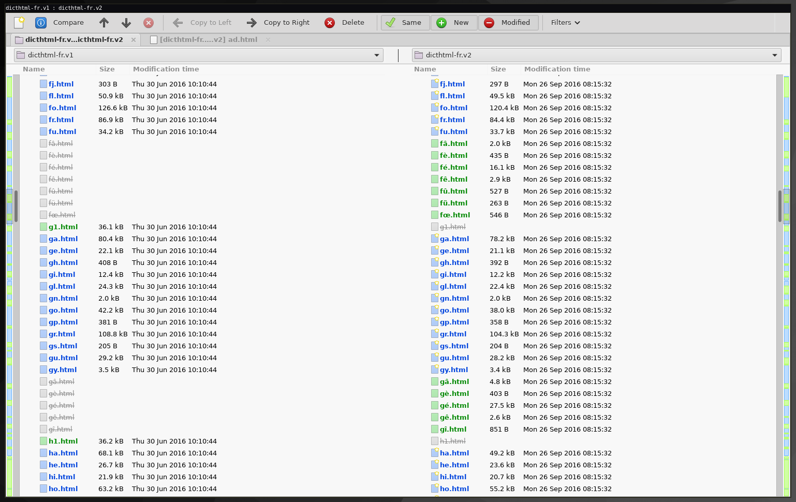
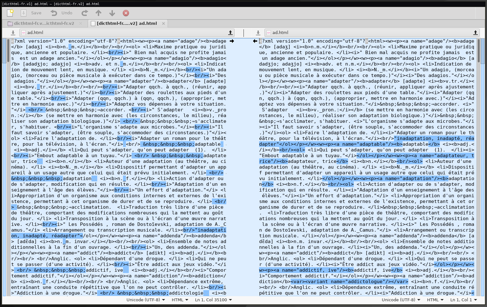

# Dicthtml v1/v2
In firmware 4.7.10364 (December 2017), Kobo introduced a new version of the dictionaries.

The v1 dictionaries are served from download.kobobooks.com/ereader/dictionaries/dicthtml\*.zip, while the v2 dictionaries are served from download.kobobooks.com/ereader/dictionaries/v2/dicthtml\*.zip.

While the v1 dictionaries are still available (probably for the Kobo Mini, which is still on 3.19.5761), they will not fully work on newer firmware versions due to the prefix changes.

I haven't looked at the exact details about v1 dictionaries, but the main change seems to be the rules for computing prefixes for words with accents.

## Prefix changes

The primary change in v2 was the removal of the last step of prefix calculation - converting all non-ascii characters to `1`s. Note that this step is done after checking that the first two characters are all Unicode letters (which include accented letters), hence why the prefix wouldn't be `11` (which is used if any of the first 2 characters are not Unicode letters).

## Built-in dictionary fixes

In addition, Kobo fixed some bugs with the dictionaries themselves. In v1, a few dictionaries were missing `<w>` tags around some words, presumably because the conversion code was buggy and the input format was undocumented/unstructured.

As illustrated by the diff above, some words weren't separated properly and a few line breaks were missing in v1.